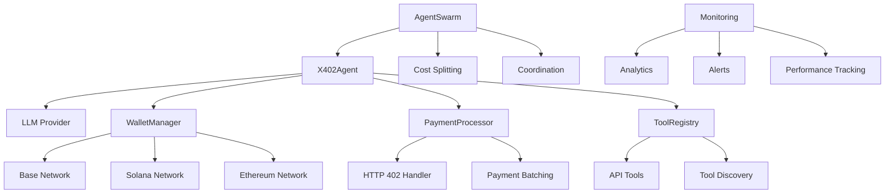

# x402-Agent Framework Documentation

Welcome to the comprehensive documentation for the x402-Agent Framework - the first autonomous AI agent system with built-in micropayment capabilities.

## 🚀 What is x402-Agent Framework?

The x402-Agent Framework enables AI agents to autonomously pay for API access, tools, and services using cryptocurrency micropayments. When an agent encounters an HTTP 402 "Payment Required" response, it automatically processes the payment and continues with the task - no human intervention required.

### Key Features

- **🤖 Autonomous Payments**: Agents handle micropayments automatically
- **💳 HTTP 402 Integration**: Seamless payment processing for APIs
- **🔗 Multi-Agent Swarms**: Collaborative agents with cost-splitting
- **📦 Payment Batching**: Efficient transaction bundling
- **🌐 Multi-Blockchain**: Support for Base, Solana, and Ethereum networks
- **📊 Built-in Analytics**: Comprehensive spending and performance tracking

## 📚 Documentation Structure

### Getting Started
- **[Installation & Setup](./guides/getting-started.md)** - Get up and running quickly
- **[Basic Usage Examples](./examples/basic-usage.md)** - Practical examples for common tasks
- **[Troubleshooting Guide](./guides/troubleshooting.md)** - Solve common issues

### Core Concepts
- **[Multi-Agent Swarms](./guides/multi-agent-swarms.md)** - Collaborative agent systems
- **[Production Deployment](./guides/production-deployment.md)** - Enterprise deployment guide

### API Reference
- **[X402Agent](./api/agent.md)** - Main agent class documentation
- **[WalletManager](./api/wallet.md)** - Cryptocurrency wallet management
- **[PaymentProcessor](./api/payments.md)** - HTTP 402 payment handling
- **[AgentSwarm](./api/swarm.md)** - Multi-agent coordination
- **[ToolRegistry](./api/tools.md)** - API tool management
- **[Monitoring](./api/monitoring.md)** - Analytics and performance tracking

## 🎯 Quick Start

### 1. Installation

```bash
pip install x402-agent
```

### 2. Basic Agent

```python
from x402_agent import X402Agent
from langchain_openai import ChatOpenAI

# Create agent
agent = X402Agent(
    llm=ChatOpenAI(model="gpt-4"),
    wallet_key="your_private_key",
    network="base"
)

# Register API tool
agent.register_tool(
    name="weather",
    endpoint="https://api.weather.com/v1/current",
    description="Get weather data"
)

# Run task with automatic payments
result = agent.run("What's the weather in San Francisco?")
```

### 3. Multi-Agent Collaboration

```python
from x402_agent.swarm import AgentSwarm

# Create swarm
swarm = AgentSwarm(shared_wallet=True)
swarm.add_agent(researcher, "researcher")
swarm.add_agent(analyst, "analyst")

# Collaborate on task
result = swarm.collaborate(
    "Research AI developments and create analysis report",
    strategy="sequential"
)
```

## 🌟 Use Cases

### Business Applications
- **Market Research**: Automated data collection and analysis
- **Content Creation**: AI-powered writing and optimization
- **Customer Support**: Intelligent ticket routing and responses
- **Financial Analysis**: Real-time market monitoring and reporting

### Developer Tools
- **API Testing**: Automated endpoint testing with payment handling
- **Data Pipeline**: Autonomous data processing workflows
- **Monitoring**: Intelligent system monitoring and alerting
- **Integration**: Seamless third-party service integration

### Research & Analytics
- **Academic Research**: Automated literature review and analysis
- **Trend Analysis**: Real-time trend detection and reporting
- **Competitive Intelligence**: Automated competitor monitoring
- **Sentiment Analysis**: Social media and news sentiment tracking

## 🏗️ Architecture Overview



## 🔧 Core Components

### X402Agent
The main agent class that orchestrates LLM interactions, payment processing, and tool execution.

### WalletManager
Handles cryptocurrency wallet operations across multiple blockchain networks with secure key management.

### PaymentProcessor
Processes HTTP 402 responses, manages payment batching, and handles transaction retries.

### AgentSwarm
Coordinates multiple agents for collaborative tasks with automatic cost-splitting and resource sharing.

### ToolRegistry
Manages API tool registration, discovery, and execution with automatic payment integration.

### Monitoring
Provides comprehensive analytics, performance tracking, and real-time alerting capabilities.

## 🌐 Supported Networks

### Base Network (Primary)
- **Native Token**: ETH (for gas)
- **Payment Token**: USDC
- **RPC**: https://mainnet.base.org
- **Explorer**: https://basescan.org

### Solana Network
- **Native Token**: SOL (for fees)
- **Payment Token**: USDC
- **RPC**: https://api.mainnet-beta.solana.com
- **Explorer**: https://solscan.io

### Ethereum Network (Coming Soon)
- **Native Token**: ETH (for gas)
- **Payment Token**: USDC
- **RPC**: https://mainnet.infura.io
- **Explorer**: https://etherscan.io

## 💡 Key Concepts

### HTTP 402 Payment Required
The framework leverages the HTTP 402 status code to enable seamless API monetization. When an agent encounters a 402 response, it automatically:

1. Parses payment requirements from response headers
2. Validates payment amount and recipient
3. Processes cryptocurrency payment
4. Retries the original request with payment proof

### Deferred Payment Batching
To optimize gas costs, payments can be batched together:

- Multiple API calls accumulate pending payments
- Batch processing occurs when threshold is reached
- Single blockchain transaction handles multiple payments
- Significant gas cost savings for high-frequency usage

### Multi-Agent Coordination
Agents can collaborate on complex tasks:

- **Parallel**: All agents work simultaneously
- **Sequential**: Agents work in order, building on previous results
- **Divide & Conquer**: Task split into subtasks for different agents

## 📊 Token Economics

### Native X402 Token (Coming Soon!)

The x402-Agent ecosystem will be powered by the native X402 utility token:

- **Governance**: Protocol upgrades and parameter changes
- **Staking**: Rewards for API providers and infrastructure operators
- **Premium Features**: Advanced analytics and enterprise capabilities
- **Marketplace**: Agent and tool marketplace transactions

**Contract Address**: Coming Soon! 🚀

Stay tuned for the official token launch announcement on our community channels.

## 🤝 Community & Support

### Getting Help
- **Documentation**: Comprehensive guides and API reference
- **GitHub Issues**: Bug reports and feature requests
- **Discord Community**: Real-time chat and support
- **Stack Overflow**: Technical questions with `x402-agent` tag

### Contributing
- **Code Contributions**: Submit PRs for new features and fixes
- **Documentation**: Help improve guides and examples
- **Testing**: Report bugs and test new features
- **Community**: Help other users and share use cases

### Links
- **GitHub**: https://github.com/x402-agent/x402-agent-framework
- **PyPI**: https://pypi.org/project/x402-agent/
- **Discord**: https://discord.gg/x402-agent
- **Twitter**: https://twitter.com/x402agent
- **Medium**: https://medium.com/@x402agent

## 🗺️ Roadmap

### Current (Q4 2024)
- ✅ Core framework release
- ✅ Base Network integration
- ✅ Multi-agent swarms
- 🔄 Solana Network support
- 🔄 Enhanced documentation

### Q1 2025
- 🔮 Native X402 token launch
- 🔮 Agent marketplace beta
- 🔮 Ethereum Network support
- 🔮 Advanced analytics dashboard
- 🔮 Enterprise features

### Q2 2025
- 🔮 Cross-chain agent interactions
- 🔮 AI model marketplace
- 🔮 Decentralized governance
- 🔮 Mobile SDK
- 🔮 Partnership integrations

### Q3 2025
- 🔮 Layer 2 expansions
- 🔮 Advanced security features
- 🔮 Agent lending protocols
- 🔮 Real-time collaboration
- 🔮 Global hackathons

## 📄 License

The x402-Agent Framework is released under the MIT License. See [LICENSE](https://github.com/x402-agent/x402-agent-framework/blob/main/LICENSE) for details.

## 🙏 Acknowledgments

Built with ❤️ by the x402-Agent team, powered by:

- **LangChain** for LLM integration
- **Web3.py** for blockchain interactions
- **Base Network** for L2 infrastructure
- **OpenAI** for AI capabilities

---

**Ready to build autonomous AI agents?** Start with our [Getting Started Guide](./guides/getting-started.md) and join the future of AI-powered automation! 🚀

*Empowering the future of autonomous AI through seamless micropayments*